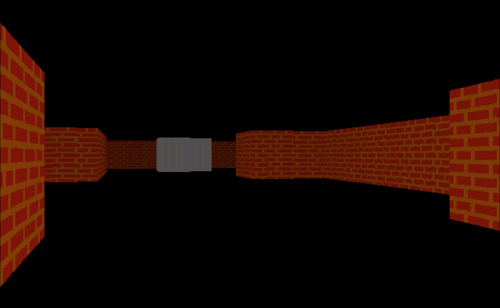

# ⬛ IronSpace

> A work-in-progress raycaster engine built from scratch in C using SDL2 — inspired by the classic Wolfenstein 3D style of rendering.



---

## 🕹️ Story

It is the late 23nd century. Humanity has long since colonized Mars — and those colonies have long since stopped answering to Earth.

Over generations, the Martian settlements grew into a fully independent civilization. Prosperous, democratic, and self-sufficient, Mars became everything Earth was not. Back home, resources dried up, populations swelled, and one authoritarian regime replaced another. Earth looked up at the red sky and saw not a neighbor, but a debt unpaid.

The war was inevitable.

Earth's forces launched a campaign to reclaim Mars by force, declaring the colonies illegal sovereign states. You are a soldier on the wrong side of that argument — captured in combat, dragged across the void, and thrown into a Martian detention facility somewhere in the iron corridors of the occupied zone.

They took your weapons. They took your freedom. They didn't take your access to their network.

**IronSpace** — the name is not an accident. *ISP*: the Interplanetary Systems Protocol, Mars's backbone infrastructure. Communications, defenses, supply chains — all of it runs through ISP. Your mission is simple: escape the facility, get inside their network, and bring the whole thing down from within.

*They built their civilization on iron and code. You'll tear it apart the same way.*

---

## ✨ Features

- **Raycaster renderer** — pseudo-3D rendering using ray casting, no GPU needed
- **Texture mapping** — walls rendered with per-tile textures loaded from PNG assets
- **Depth shading** — walls darken with distance for a sense of depth
- **Multi-tile support** — each grid cell has its own `type` and `texture_asset_id`
- **Asset manager** — loads and manages PNG textures via SDL2_image

---

## 🛠️ Building

### Requirements

- Linux
- GCC or Clang
- CMake `>= 3.10`
- SDL2
- SDL2_image

### Install dependencies (Debian/Ubuntu)

```bash
sudo apt install cmake libsdl2-dev libsdl2-image-dev
```

### Build

```bash
git clone https://github.com/hupeyaszih/IronSPace.git
cd ironspace
mkdir build && cd build
cmake build ..
cmake --build .
```

### Run

```bash
./ironspace
```

## 📁 Project Structure

```
.
├── assets
│   ├── 1.png
│   ├── 2.png
│   └── wall.png
├── CMakeLists.txt
├── include
│   ├── asset_manager.h
│   ├── game.h
│   ├── game_map.h
│   ├── player.h
│   └── renderer.h
├── LICENSE
├── README.md
└── src
    ├── asset_manager.c
    ├── game.c
    ├── game_map.c
    ├── main.c
    ├── player.c
    └── renderer.c
```

---

## 🚧 Status

This project is actively in development. Expect bugs, missing features, and sudden architectural changes.

**Planned:**
- Floor and ceiling rendering
- Sprite rendering
- Minimap
- Enemy AI

---
